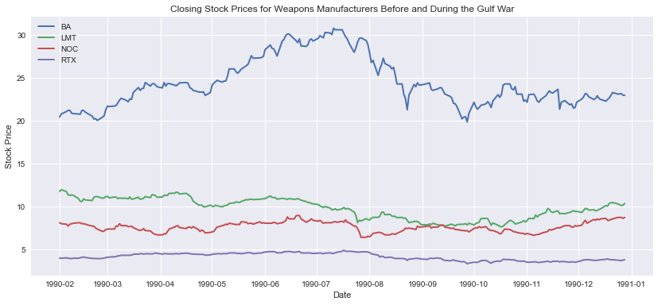
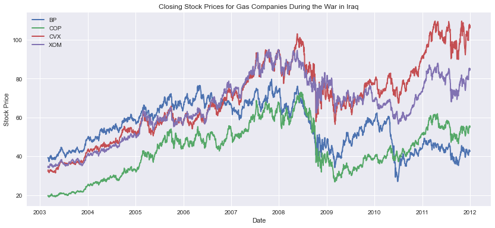
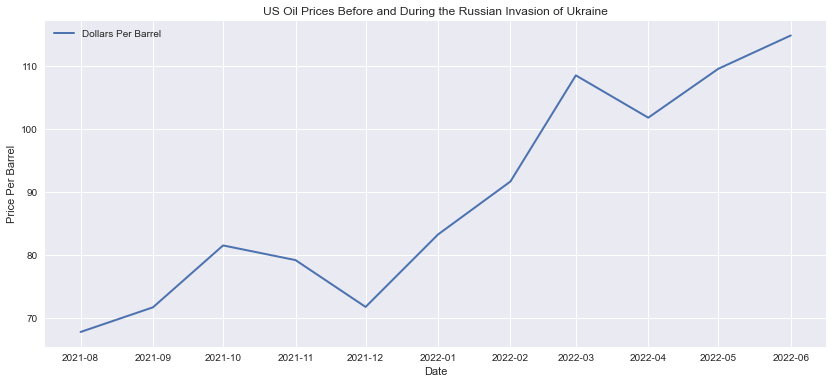
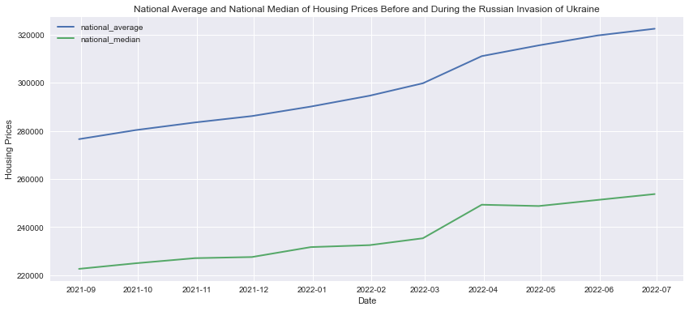
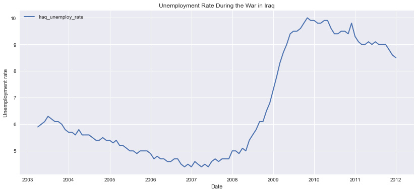
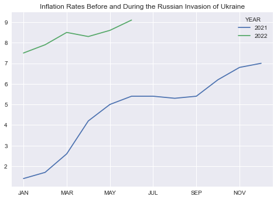
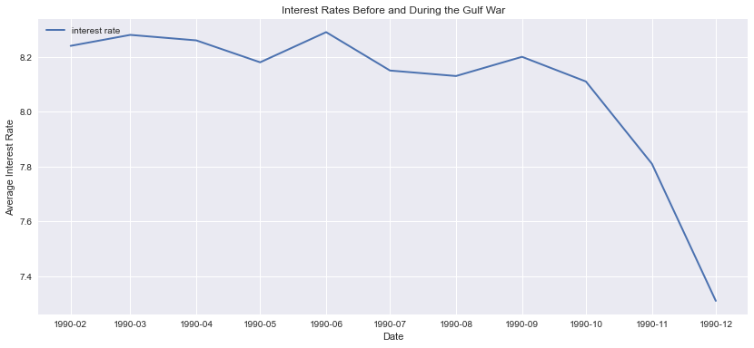

# Collateral Damage: The Effect of War on Stocks, Housing, and Unemployment

## **Project Overview**

### *Package Requirements and Versions*

`pip install x` ; where 'x' is the package listed below:
* `python == 3.7.13+` 
* `numpy == 1.21.5`
* `pandas == 1.3.5+`
* `hvplot == 0.7.3`
* `matplotlib == 3.5.1`
* `json == 2.0.9`
* `quandl == 3.7.0`
* `yfinance == 0.1.74`
* `plotly.express == 5.9.0`

### *Files Navigation*
* Resources: Directory containing all images of plots created in Jupyter Notebook, and original csv data files
* `Data Exploration and Cleanup.ipynb`: Data exploration investigating csv files and API connections, cleanup of dataframes, and final dataframes and all graphs
  
### *Purpose of Use* 
  Our team decided to investigate the effects of an existing war and how that is reflected on stock prices for weapon manufacturers and stock prices for gas companies, and how those can effect the cost of crude oil, housing prices, and the unemployment rate. Our time references for wars are the Gulf War, the Iraq War, and the Russian Invasion of Ukraine.

The business question we hope to answer is: *if we can predict an increase or decline in stock prices for weapon manufacturers and gas companies when there is an existing war. Additionally, we hope to be able to answer if we can predict a rise or decline in crude oil prices, housing prices, and the unemployment rate when there is an existing war.*

Our motivation for taking on this challenge is to find out if there is clear causation, or merely a correlation, between the effect of war on stock prices as well as crude oil prices, housing prices, and the unemployment rate.

We hope to find this data using stock data from Nasdaq Data Link, the cost of crude oil from the U.S. Energy Information Administration, the cost of housing prices from Data.gov, and the effect on unemployment rates from the U.S. Department of Labor.

The periods of war analyzed include:
* Data Dates (6 months before official start date, and 5 months into war, except for Iraq War):
  * Gulf War: February 1990 - December 1990
  * Iraq War: March 2003 - December 2011
  * Russian Invasion of Ukraine: August 2021 - June 2022
* Actual Dates:
  * Gulf War: August 2, 1990 – February 28, 1991
  * Iraq War: March 20, 2003 – December 15, 2011
  * Russian Invasion of Ukraine: February 24, 2022 - Present

___

## Data Pre-Processing/Gathering Steps (Cleaning and Manipulation)
Our team accessed stock data and crude oil prices from Nasdaq Data Link, Yahoo Finance, and the U.S. Energy Information Administration.

To gather both the weapons manufacturer and the gas companies' stock data, we used Yahoo Finance. We used the tickers $LMT, $BA, $RTX, and $NOC to get a comprehensive list of the major U.S. weapons manufacturers. After connecting via API to Nasdaq Data Link, we created a dataframe of all of the tickers' closing prices, and narrowed it down further by only keeping the data for the time periods analyzed. We followed the same process to obtain the oil companies' closing stock prices for the same time periods. The gas company tickers analyzed were $XOM, $BP, $COP, and $CVX. Once the data was obtained and processed, we created line plots for each period of war.

After gathering the stock data, we determined the best data available regarding crude oil prices was from the U.S. Energy Information Administration. They provided a comprehensive csv of crude oil prices in dollars per barrel. Once that csv was turned into a dataframe by using pandas, we narrowed it down further to create three dataframes representing the three period of war analyzed, and plotted those. 

Obtaining average housing prices was much more challenging compared to previously obtained data. This data was the most complex and needed the most manipulation because the data available from Zillow through the Nasdaq Data Link API was separated into regions of the U.S., and not states. First, it was necessary to identify which regions corresponded with which zip codes. Then we matched each zip code to a specific state. A random sample of 30 prices for each state was picked and then grouped together to find the national average. Once this was complete, we created one dataframe for the Russian Invasion of Ukraine, because this API did not include historical data for the other two periods of war. We obtained the remaining data from the Federal Reserve Economic Data and downloaded csv files containing the quaterly average price index for housing in the U.S. After reading the csv files via pandas, we also created two additional dataframes analyzing the data for the Iraq War and the Gulf War. These dataframes were plotted using line graphs and also a dynamic map using hvPlot. In order to create the hvPlot for the Iraq War, a list of states and their coordinates was concatinated with the list of average prices.

Next, we gathered unemployment data using both the Federal Reserve Economic Data via the Nasdaq Data Link API, and the U.S. Bureau of Labor Statistics via a json request. Once that data was pulled and turned into dataframes, we were able to plot them in line graphs. 

After analyzing the above data and plots, we realized there were other data points needed to get a broader view of the question we wanted to answer. As a result, we obtained both the inflation rate data and interest rate data for all three periods of war. We obtained both datasets from the Federal Reserve Economic Data library via downloaded csv files. Like previous processes, the data was read via pandas and turned into dataframes, and then plotted for each period of war. 

## Visuals and Explanations

Using line graphs, we plotted the closing stock prices for weapons manufacturers and gas companies, and also the price of crude oil. Below is a sample of each. All plots can be found in `Data Exploration and Cleanup.ipynb`.

Closing stock prices for weapons manufacturers before and during the Gulf War

Closing stock prices for gas companies during the Iraq War

Crude oil prices per barrel before and during the Russian Invasion of Ukraine

Next, we plotted the average and median housing prices, or the average index during each period of war.

Average and median housing prices before and during the Russian Invasion of Ukraine

Initially, we thought the last set of data would be the unemployment rate data, of which a sample of plots is below.

After analyzing some of the previous plots, we realized we needed to gether more information such as historical inflation rate data and interest rate data. More information on conclusions can be found below, but the above graph is an example of how other factors such as inflation and interest rates can affect the unemployment rate. 

Inflation Rates Before and During the Russian Invasion of Ukraine

Interest rates before and during the Gulf War

All graphs not included here can be found in the Resources folder or `Data Exploration and Cleanup.ipynb`.

## Additional Explanations and Major Findings

Our primary finding is that war and gas prices may not correlate as simply as most Americans are lead to believe. Shortly after Russia invaded Ukraine in February of 2022, prices at the pump began a rise to all-time highs; soaring past $7.00 in some places and nearing $10.00 in others. Americans were told that these skyrockecting gas prices were due to the sanctions President Biden imposed on Russia, Europe's largest oil distributor, and that these sanctions were the direct result of Russia's actions in Ukraine. This narrative lead us to investigate the historical effect of war on gas prices, to see if the current bump in prices should be expected based on what happpened in the past during periods of war.

To begin our investigation, we took a look at the stock prices for some major weapons and gas companies, and compared them to the price of oil during times of war. The weapons companies we gathered info for are Lockheed Martin Corp., Boeing, Raytheon, and Northrop Grumman. The gas companies are Exxon Mobil, BP, ConocoPhillips, and Chevron Corporation. The periods of war needed to be recent enough for us to find the relevant data, which led us to the Gulf War, and the Iraq War to compare alongside the Russian Invasion of Ukraine. Using this data our group hoped to find trends that suggest changes in the prices of these companies as a direct consequence of an existing war.

Through the first part of our investigation, we found little data that clearly indicates the correlation between stock prices of our chosen companies, and ongoing war. The first indication that war might affect a company's stock price is a sizable spike in Boeing's price near the start of the Gulf War. However, in taking a deeper look into the price hike, we found out that it was due to the excitement over Boeing's announcement of a new commercial aircraft, the 777. The next indication is the rise of weapons stocks during the beginning of the Iraq War. These prices see a steady increase, right up until the 2008 recession, where they crash and fail to return to their pre-recession levels. The weapons prices during the the Russian Invasion of Ukraine show that two of our companies' prices are increasing while the other two decrease as the war progresses.
  
Generally we can see that the stock prices move during times of war, but this doesn't make it clear that the prices moved because of the war. It is also worth noting that the companies we chose are regarded as the top four companies in their domains, and are the most likely to be affected by a change in their respective markets.

Next, we took a look at the Dollar Per Barrel price of crude oil and how it changed during each war. Looking at this data, we can see clearly that oil prices generally tend to rise during times of war. For both the Gulf War and the Russian Invasion of Ukraine, we see noticeable spikes in oil prices at the start of each conflict indicating that the news of war might directly impact oil prices in the short term. For the Iraq War, we actually see a small dip in oil prices at the start, but we see the same trend of prices increasing accross the duration of the conflict. With this data, it is reasonable to assume that war does have an effect on oil prices, although it is not clear how, or even how much it affects prices when compared to other variables.

After analyzing our initial dataset, we discussed the other variables that we believe may play a role in our research, and decided that inflation should be the key indicator that we consider alongside what we initially gathered. Our data shows spikes in inflation that occur at the same time as the spikes we see in gas prices during the Gulf War and Russian Invasion of Ukraine. For the Gulf War we get a graph very similar to the graph of oil prices during that time, suggesting that they are closely correlated. The same can be said for the graphs of inflation and oil prices during the Russian Invasion of Ukraine. Both show spikes near the beginning of the invasion and as inflation continues to rise, so does the cost of oil.

After analyzing stock and oil prices, we decided to direct our attention towards the U.S. housing and umeployment rates during our selected wars. Taking a look first at the Russian Invasion of Ukraine, we can see that housing prices have been on a steady incline since the beginning of the war. Given this we can expect the unmployment rate to be on a steady decline, which is exactly what we see when taking a look at the plot of the data. The same pattern plays out for the housing and unemployment data during the Iraq War. The data suggest that the two markets directly correlate to one another and are inversely related. 

Our most interesting find comes when observing this same dataset for the Gulf War. According to our data, unemployment went up during this time, and housing prices went down. While the markets did move according to their established relationship discussed above, this data represents an anomaly because we would expect them to move in the opposite directions, as they did during the other wars that we investigated. 

We suspect the main culprit for our anomaly to be changing interest rates, so we investigated them for each war. For both the Russian Invasion of Ukraine and the War in Iraq, we see interest rates spike during the early part of each timeline. They eventually dropped towards the end of the Iraq War, so we might see something similar near the end of the Russian Invasion of Ukraine. For now we can see that interest rates continue to increase as that conflict ensues.

The interest rates during the Gulf War have a different trajectory. At the start of the war, they were higher than they ever got during the Iraq War, and higher than the rates that we currently see during the Russian Invasion of Ukraine. This is likely due to the rates recovering from the all-time highs that occured during the early 1980s. Because the rates were already so high, we don't see the same spike that occurs during the other wars, and instead we see them stay relatively steady until they begin to fall as the war nears it's end.

## Challenges, Limitations and Future Development

The initial challenge was pulling out housing data, as the main sources that gather data are not very generous with it. Most of this data is pulled by the National Association of Realtors, which is the main custodian of the Multiple Listing Service. This data is then pulled by other real estate companies such as Zillow, Redfin, or Realtor.com. But they also are not generous with their data either. Thankfully, Nasdaq Data Link gathers housing data through Zillow, and not just its stock price, and provides that gratuitously through their API. But because it is broken into small regions, it all needed to be cleaned and combined to provide the national average and median average.

After gathering and plotting all of the data, the limitations of this project are that there are multiple factors that could be influencing each other at various times. It is not always easy to isolate each factor and say for certain without a shadow of a doubt that one factor necessarily influenced another. For instance, we initially set out to explore how war may affect weapon manufacturers. Generally it would seem as though their stock prices went up before the war but then not much during war. Perhaps this is an instance of people "buying the rumor and selling the news." The only weapons manufacturer that had sharp fluctuation was Boeing, which may have been due to the release of a new product that was not even closely related to the war. The point remains that one would have to look at the news for each company every day for that period to see if there are other factors affecting the stock prices. The same could be said about housing data. It seems like there is more correlation with inflation than with war. More recently there was a pandemic that affected demand in houses due to people working from home and people having more money for a downpayment from stimulus checks. These were all factors not affected by conflict. With the time constraints for this project it would be hard to generate a bird's eye view of all the factors affecting each other.

Limitations are clear pointers to future development. The relationship between all these factors is something that we could look at in the future. Now, if we are able to predict some of the future based on our current analysis, we could say that perhaps that some of the results from the Russian Invasion of Ukraine will not be so different from the results of the Gulf War. For instance, though oil prices increased at the beginning of each conflict, it is clear that during the Gulf War it eventually plateued and then went down. There may be a repeat of that in the current conflict. This is because countries, organizations, and people make adjustments to price fluctuations. For instance OPEC said they would increase oil production in response to the war. People are starting to buy more electric cars, etc. 

## Conclusion

While wartime may have had an effect on the markets we studied, we cannot reasonably conclude that war was the primary catalyst for the movements we observed. This is made clear by the fact that the major changes we found in our dataset coincide directly with changes in inflation and interest rates during the periods that we chose for our investigation.

The Federals Reserve's main job is to promote employment and keep inflation in check by lowering or raising short term interest rates. Looking at the gulf war, interest rates were at eight percent and we can see how the home prices saw a decline. Unemployment was also very low prior to the war. Prior to the Gulf War the Federal Reserve took drastic measures to fight inflation by using their most powerful tool, demand destruction. This process is effective when implemented at the right time. Jerome Powell did not have that luxury going into this conflict with Ukraine. Powell has mentioned since last march that the inflation we have been experiencing is transitory. Based off our data, if the Fed had started raising interest rates a long time ago, we could be in a better position.

Understanding the role of inflation and interest rates in our data allowed us to ask ourselves "What other variables could be at play here?" Through further research and discussion we came up with: easing of COVID-19 restrictions, supply chain distruptions caused by the pandemic, America's level of involvement in each war, the seasonality of gas prices, and the 2008 recession. Due to the number of potential variables outside of what we analyzed in this study, we find it dificult to predict definitively that gas prices will rise, just because there is an existing war.

One consideration that would make this all more clear, is deepening our understanding of how war affects interest rates and inflation. We know that these variables have a huge impact on our data, but it was not made apparent until we got near the end of our project and asked ourselves how war affects these variables. Given more time, this is where we would focus our efforts because discovering that war causes inflation and interest rates to rise would give us a definitive picture of how war affects gas, stock, and housing prices as well.

## References

* Yahoo Finance
* Nasdaq Data Link APIs:
  * Zillow
  * Federal Reserve Economic Data
* U.S. Energy Information Administration
* Federal Reserve Economic Data
* Coordinates of 50 states: https://gist.github.com/dikaio/0ce2a7e9f7088918f8c6ff24436fd035
* U.S. Bureau of Labor Statistics

## Team Members:

* Darius Griffin (Project Manager)
* Bryan Follenweider
* Lara Barger
* Miguel Ramos
* Yohan Hwang
